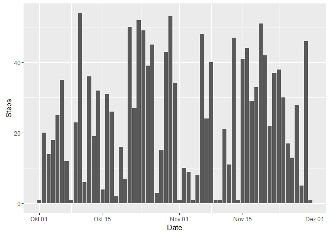
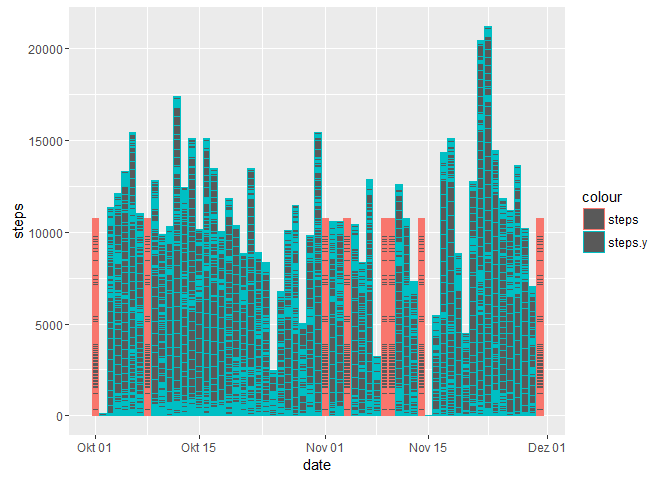

# Reproducible Research: Peer Assessment 1


## Loading and preprocessing the data
## download files

```r
fileURL <- "https://d396qusza40orc.cloudfront.net/repdata%2Fdata%2Factivity.zip"
download.file(fileURL, "data.zip")
unzip("data.zip")
activity.data <- read.csv("activity.csv", sep=",", header=TRUE, stringsAsFactors=FALSE)
```

The variables included in this dataset are:

* **steps**: Number of steps taking in a 5-minute interval (missing
    values are coded as `NA`)

* **date**: The date on which the measurement was taken in YYYY-MM-DD
    format

* **interval**: Identifier for the 5-minute interval in which
    measurement was taken

```r
library(xtable)
        headactivity <-xtable(head(activity.data))
        print(headactivity,type="html")
```

<!-- html table generated in R 3.3.1 by xtable 1.8-2 package -->
<!-- Tue Dec 13 11:24:15 2016 -->
<table border=1>
<tr> <th>  </th> <th> steps </th> <th> date </th> <th> interval </th>  </tr>
  <tr> <td align="right"> 1 </td> <td align="right">  </td> <td> 2012-10-01 </td> <td align="right">   0 </td> </tr>
  <tr> <td align="right"> 2 </td> <td align="right">  </td> <td> 2012-10-01 </td> <td align="right">   5 </td> </tr>
  <tr> <td align="right"> 3 </td> <td align="right">  </td> <td> 2012-10-01 </td> <td align="right">  10 </td> </tr>
  <tr> <td align="right"> 4 </td> <td align="right">  </td> <td> 2012-10-01 </td> <td align="right">  15 </td> </tr>
  <tr> <td align="right"> 5 </td> <td align="right">  </td> <td> 2012-10-01 </td> <td align="right">  20 </td> </tr>
  <tr> <td align="right"> 6 </td> <td align="right">  </td> <td> 2012-10-01 </td> <td align="right">  25 </td> </tr>
   </table>
## What is mean total number of steps taken per day?

1. Make a histogram of the total number of steps taken each day


```r
totalsteps <-tapply(activity.data$steps, activity.data$date,sum,na.rm = TRUE)
#convert rownames to column
totalsteps2 <-cbind(rownames(totalsteps),totalsteps)
rownames(totalsteps2) <-NULL
#rename columns 
colnames(totalsteps2) <-c("Date","Steps")
# transform the data for analysis
df1<-as.data.frame(totalsteps2)
df1$Date <-as.Date(df1$Date)
df1$Steps <-as.numeric(df1$Steps)
#plot the data
library(ggplot2)
ggplot(df1, aes(x=Date, y=Steps)) +geom_bar(stat="identity")
```

<!-- -->

```r
#plot(df1$Date,df1$Steps, type="h")
```

2. Calculate and report the **mean** and **median** total number of steps taken per day

```r
meansteps <- mean(df1$Steps,na.rm=TRUE)
mediansteps <-median(df1$Steps,na.rm=TRUE)
```
The **mean** total number of steps taken per day is: **24.4590164**.
The **median** total number of steps taken per day is: **24**.

## What is the average daily activity pattern?


```r
average.steps <-tapply(activity.data$steps, activity.data$interval,mean,na.rm = TRUE)
#convert rownames to column
average.steps2 <-cbind(rownames(average.steps),average.steps)
rownames(average.steps2) <-NULL
#rename columns 
colnames(average.steps2) <-c("Interval","Mean.Steps")

# transform the data for analysis
df1<-as.data.frame(average.steps2)
df1$Interval<-as.numeric(df1$Interval)
df1$Mean.Steps <-as.numeric(df1$Mean.Steps)
#plot the data

plot(average.steps2,type="l", xlab="Interval", ylab="Number of Steps",main="Average Number of Steps per Day by Interval")
```

<!-- -->

2. Which 5-minute interval, on average across all the days in the dataset, contains the maximum number of steps?


```r
df2 <-df1[which(df1$Mean.Steps == max(df1$Mean.Steps)), ]
library(xtable)
df3 <-xtable(df2)
        print(df3,type="html")
```

<!-- html table generated in R 3.3.1 by xtable 1.8-2 package -->
<!-- Tue Dec 13 11:24:16 2016 -->
<table border=1>
<tr> <th>  </th> <th> Interval </th> <th> Mean.Steps </th>  </tr>
  <tr> <td align="right"> 226 </td> <td align="right"> 121.00 </td> <td align="right"> 254.00 </td> </tr>
   </table>

## Imputing missing values

Note that there are a number of days/intervals where there are missing
values (coded as `NA`). The presence of missing days may introduce
bias into some calculations or summaries of the data.

1. Calculate and report the total number of missing values in the dataset (i.e. the total number of rows with `NA`s)

```r
colSums(is.na(activity.data))
```

```
##    steps     date interval 
##     2304        0        0
```
2. Devise a strategy for filling in all of the missing values in the dataset. 

The mean of the 5-minute interval is used for the missing values.

3. Create a new dataset that is equal to the original dataset but with the missing data filled in.

```r
new.data <- na.omit(activity.data)

averages <- aggregate(new.data$steps, list(interval = as.numeric(as.character(new.data$interval))), FUN = "mean")
names(averages)[2] <- "Mean.Steps"
act.imp <- activity.data
for (i in 1:nrow(act.imp )) {
        if (is.na(act.imp $steps[i])) {
                act.imp $steps[i] <- averages[which(act.imp $interval[i] == averages$interval), ]$Mean.Steps
        }
}
```

4. Make a histogram of the total number of steps taken each day and Calculate and report the **mean** and **median** total number of steps taken per day. Do these values differ from the estimates from the first part of the assignment? What is the impact of imputing missing data on the estimates of the total daily number of steps?


```r
act.imp$date <-as.Date(act.imp$date)
ggplot(act.imp, aes(x=date, y=steps)) +geom_bar(stat="identity")
```

<!-- -->

```r
temp <- tapply(act.imp$steps, act.imp$date,sum)
mean.imp <- mean(temp)
median.imp <- median(temp)
```
The **mean** total number of steps taken per day is: **1.0766189\times 10^{4}**.
The **median** total number of steps taken per day is: **1.0766189\times 10^{4}**.


```r
activity.data$date <- as.Date(activity.data$date)
compared.data <- cbind(act.imp,activity.data$steps)
names(compared.data)[4] <- "steps.y"
compared.data <- compared.data[, c("steps","steps.y","date","interval")]
ggplot(compared.data, aes(x=date)) + geom_bar(aes(y=steps,colour="steps"),stat="identity") +geom_bar(aes(y=steps.y, colour="steps.y"),stat="identity")
```

```
## Warning: Removed 2304 rows containing missing values (position_stack).
```

<!-- -->
## Are there differences in activity patterns between weekdays and weekends?


1. Create a new factor variable in the dataset with two levels -- "weekday" and "weekend" indicating whether a given date is a weekday or weekend day.


```r
activity.data$date <-as.Date(activity.data$date)
activity.data$weekday <- weekdays(activity.data$date)
# German language
library(dplyr)
```

```
## 
## Attaching package: 'dplyr'
```

```
## The following objects are masked from 'package:stats':
## 
##     filter, lag
```

```
## The following objects are masked from 'package:base':
## 
##     intersect, setdiff, setequal, union
```

```r
weekend_list <- c("Samstag","Sonntag")
activity.data2 <- mutate(activity.data, weektime = ifelse(activity.data$weekday %in% weekend_list,"Weekend","Weekday"))

head(activity.data2)
```

```
##   steps       date interval weekday weektime
## 1    NA 2012-10-01        0  Montag  Weekday
## 2    NA 2012-10-01        5  Montag  Weekday
## 3    NA 2012-10-01       10  Montag  Weekday
## 4    NA 2012-10-01       15  Montag  Weekday
## 5    NA 2012-10-01       20  Montag  Weekday
## 6    NA 2012-10-01       25  Montag  Weekday
```
1. Make a panel plot containing a time series plot (i.e. `type = "l"`) of the 5-minute interval (x-axis) and the average number of steps taken, averaged across all weekday days or weekend days (y-axis). 


```r
activity.data3 <- aggregate(steps ~ interval + weektime, data = activity.data2, mean) 
library(lattice)
xyplot(steps ~ interval|weektime, activity.data3, type = "l", layout = c(1, 2), 
       xlab = "Interval", ylab = "Number of steps")
```

<!-- -->


